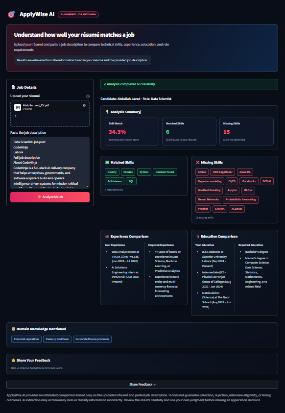

# ApplyWise AI — Functional Testing Report

## Project Information

| Item | Value |
|------|-------|
| Project | ApplyWise AI |
| Developer | Abdullah Javed |
| Internship | AI Chatbot Developer Intern — Innoviast IT Solutions and Services |
| Date | August 2026 |
| Version | v1.0 |
| Platform | Streamlit Cloud |

---

# Test Environment

| Item | Value |
|------|-------|
| Operating System | Windows 11 |
| Browser | Google Chrome |
| Programming Language | Python 3.12 |
| Frontend | Streamlit |
| Backend | Python |
| Database | Supabase |
| Deployment | Streamlit Cloud |

---

# Objective

Verify that ApplyWise AI can successfully:

- Upload PDF résumés
- Extract readable text from uploaded résumés
- Validate user input
- Compare résumés with job descriptions
- Identify matched skills
- Identify missing skills
- Compare education requirements
- Compare experience requirements
- Extract domain knowledge from job descriptions
- Store user feedback successfully

---

# Functional Test Cases

## TC01 — AI & Machine Learning Engineer

**Status:** ✅ PASS

**Technical Skill Score:** 52.0%

**Matched Skills:** 12

**Missing Skills:** 11

### Notes

- Analysis completed successfully.
- Resume skills were extracted correctly.
- Enterprise cloud and MLOps tools were correctly identified as missing.
- Experience and education comparisons were accurate.

### Evidence


---

## TC02 — Data Scientist

**Status:** ✅ PASS

**Technical Skill Score:** 34.3%

**Matched Skills:** 6

**Missing Skills:** 15

### Notes

- Analysis completed successfully.
- Core data science skills (Python, NumPy, Pandas, SQL, Scikit-learn, Random Forest) were correctly identified.
- Advanced enterprise data science and MLOps technologies were correctly identified as missing.
- Experience and education comparisons were generated accurately.

### Evidence



---

## TC03 — Data Analyst

**Status:** ✅ PASS

**Technical Skill Score:** 80.0%

**Matched Skills:** 1

**Missing Skills:** 2

### Notes

- Analysis completed successfully.
- SQL was correctly identified as a matching skill.
- dbt and Snowflake were correctly identified as missing.
- Experience comparison was accurate.
- No education requirement was detected because the job description did not specify one.

### Evidence


---

## TC04 — Business Analyst

**Status:** ✅ PASS

**Technical Skill Score:** 12.0%

**Matched Skills:** 2

**Missing Skills:** 16

### Notes

- Analysis completed successfully.
- SQL and Power BI were correctly identified as transferable skills.
- Business analysis, CRM, marketing, and communication-related requirements were correctly identified as missing.
- Experience and education comparisons were generated accurately.

### Evidence


---

## TC05 — Associate Software Engineer (Python Django)

**Status:** ✅ PASS

**Technical Skill Score:** 21.8%

**Matched Skills:** 3

**Missing Skills:** 11

### Notes

- Analysis completed successfully.
- General programming skills (Python, JavaScript, and C) were correctly matched.
- Django ecosystem technologies (Django REST Framework, ORM, Docker, REST APIs, and PostgreSQL) were correctly identified as missing.
- Experience and education comparisons were generated accurately.

### Evidence

.png)

---

## TC06 — Associate AI Engineer (Claude Certified Architect)

**Status:** ✅ PASS

**Technical Skill Score:** 50.0%

**Matched Skills:** 6

**Missing Skills:** 6

### Notes

- Analysis completed successfully.
- Core AI technologies (Python, LangChain, Prompt Engineering, RAG, and REST APIs) were correctly identified.
- Technologies not explicitly listed on the résumé (Claude APIs, Embeddings, LangGraph, LlamaIndex, and Vector Databases) were correctly identified as missing.
- Experience comparison and domain extraction behaved as expected.

### Evidence

.png)

---

## TC07 — Associate Computer Vision Engineer

**Status:** ✅ PASS

**Technical Skill Score:** 12.5%

**Matched Skills:** 3

**Missing Skills:** 21

### Notes

- Analysis completed successfully.
- Python, LangChain, and LLM were correctly identified.
- Specialized Computer Vision technologies (OpenCV, MediaPipe, OpenPose, ONNX Runtime, PyTorch, Chroma, and others) were correctly identified as missing.
- Experience comparison and domain knowledge extraction behaved as expected.

### Evidence


---

## TC08 — Principal/Staff Machine Learning Engineer

**Status:** ✅ PASS

**Technical Skill Score:** 8.0%

**Matched Skills:** 2

**Missing Skills:** 23

### Notes

- Analysis completed successfully.
- Python and LangChain were correctly identified.
- Advanced machine learning, cloud AI, and MLOps technologies were correctly identified as missing.
- Experience and education comparisons accurately reflected the seniority of the role.
- Domain knowledge extraction correctly identified major AI topics.

### Evidence


---

## TC09 — ML Engineer (Machine Learning)

**Status:** ✅ PASS

**Technical Skill Score:** 48.0%

**Matched Skills:** 3

**Missing Skills:** 7

### Notes

- Analysis completed successfully.
- NumPy, Pandas, and Python were correctly identified.
- Cloud platforms and enterprise ML technologies were correctly identified as missing.
- Experience comparison accurately reflected the required years of experience.
- Domain extraction correctly identified Machine Learning, AI, and Data Science.

### Evidence

.png)

---

## TC10 — Senior AI Engineer

**Status:** ✅ PASS

**Technical Skill Score:** 35.6%

**Matched Skills:** 4

**Missing Skills:** 6

### Notes

- Analysis completed successfully.
- Prompt Engineering, Python, RAG, and SQL were correctly identified.
- Advanced enterprise AI requirements were correctly identified as missing.
- Experience comparison accurately reflected senior-level expectations.
- Education comparison and domain extraction were generated successfully.

### Evidence


---

# Overall Testing Summary

| Metric | Result |
|---------|--------|
| Total Test Cases | 10 |
| Passed | 10 |
| Failed | 0 |
| Pass Rate | **100%** |
| Critical Issues Found | 0 |
| Minor Issues Found | 0 |

---

# Conclusion

ApplyWise AI successfully passed all planned functional test cases across multiple AI, Machine Learning, Data Science, Data Analytics, Business Analysis, Software Engineering, Computer Vision, and Backend Engineering job descriptions.

The application successfully:

- Validated user input
- Extracted text from uploaded PDF résumés
- Compared résumés with job descriptions
- Identified matched and missing skills
- Compared education requirements
- Compared experience requirements
- Extracted domain knowledge
- Accepted and stored user feedback in Supabase
- Displayed analysis results correctly through the user interface

No critical functional defects were identified during testing.

---

# Screenshot Directory

```
screenshots/
└── testing/
    ├── TC01_AI_ML_Engineer.png
    ├── TC02_Data_Scientist.png
    ├── TC03_Data_Analyst.png
    ├── TC04_Business_Analyst.png
    ├── TC05_Associate_Software_Engineer_Python_Django.png
    ├── TC06_Associate_AI_Engineer.png
    ├── TC07_Associate_Computer_Vision_Engineer.png
    ├── TC08_Principal_Staff_Machine_Learning_Engineer.png
    ├── TC09_ML_Engineer.png
    └── TC10_Senior_AI_Engineer.png
```